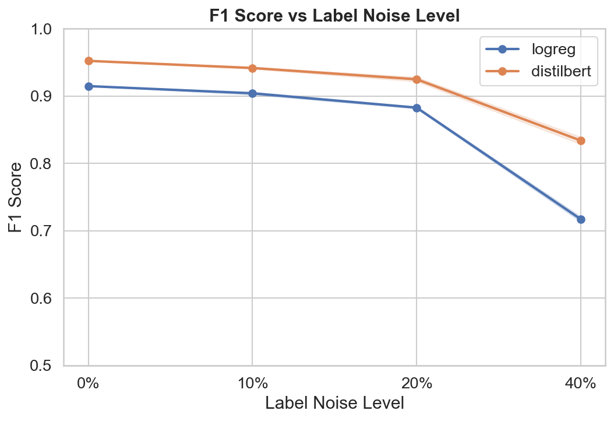
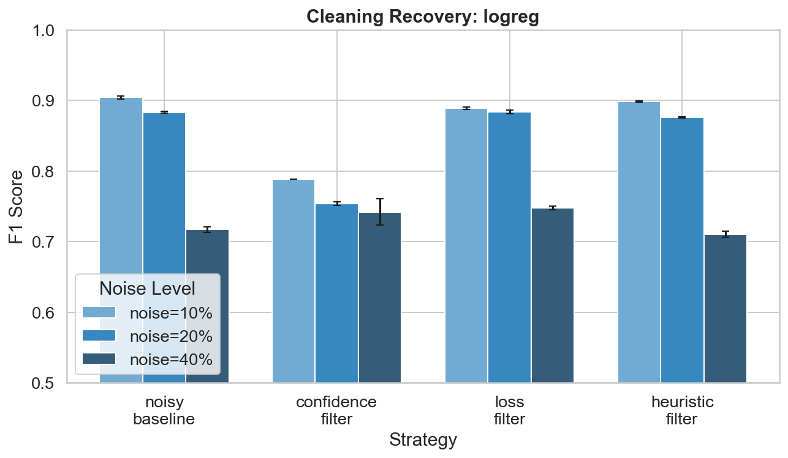
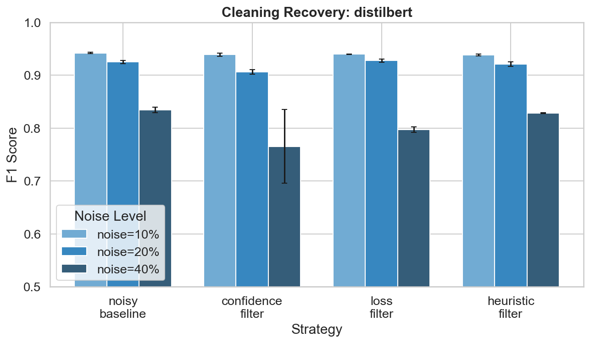
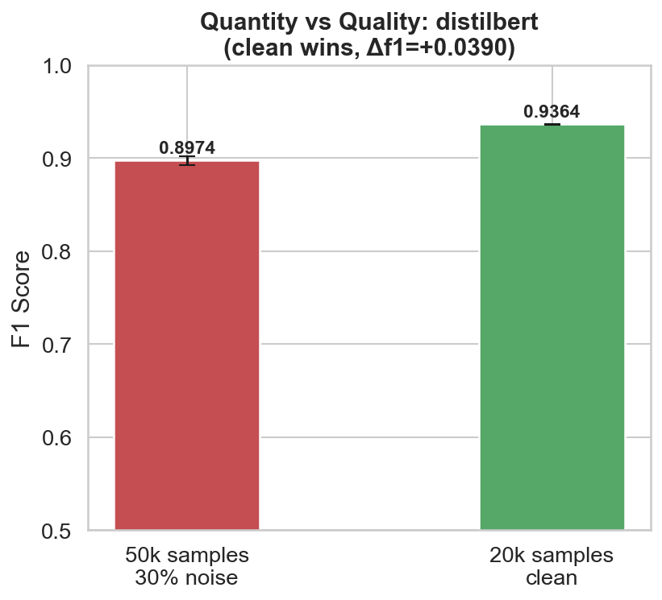

# Data Quality Benchmarking for NLP Models

Does cleaner data beat more data? Benchmarking label noise, model degradation, and data cleaning strategies on NLP sentiment classification.

---

## What this is

Most ML projects obsess over model architecture. This one obsesses over the data.

The idea is simple: take a clean dataset, deliberately corrupt it in controlled ways, measure how fast models break, then try to fix it and see how much you can recover. Do that across two very different models and three seeds, and you start to get answers that actually hold up.

The headline experiment is blunt: 20,000 clean training samples vs 50,000 samples with 30% of the labels flipped. One question -- does cleaner data beat more data?

It does. By a lot.

---

## Results

### Experiment 1 -- How fast do models break?

| Model      | 0% noise        | 10% noise       | 20% noise       | 40% noise       | Total drop |
| ---------- | --------------- | --------------- | --------------- | --------------- | ---------- |
| LogReg     | 0.9149 ± 0.0000 | 0.9042 ± 0.0020 | 0.8829 ± 0.0014 | 0.7172 ± 0.0039 | -0.1977    |
| DistilBERT | 0.9524 ± 0.0007 | 0.9418 ± 0.0014 | 0.9250 ± 0.0032 | 0.8340 ± 0.0053 | -0.1184    |

All values are F1 mean ± std across 3 seeds.



DistilBERT degrades smoothly. LogReg holds until 20% then falls off a cliff at 40%. That nonlinear collapse is one of the more interesting things to come out of this study.

### Experiment 2 -- Can cleaning fix it?

**LogReg**

| Strategy          | 10% noise       | 20% noise       | 40% noise           |
| ----------------- | --------------- | --------------- | ------------------- |
| Noisy baseline    | 0.9042 ± 0.0020 | 0.8829 ± 0.0014 | 0.7172 ± 0.0039     |
| Loss filter       | 0.8886 ± 0.0018 | 0.8838 ± 0.0025 | **0.7475 ± 0.0024** |
| Heuristic filter  | 0.8983 ± 0.0009 | 0.8755 ± 0.0008 | 0.7101 ± 0.0043     |
| Confidence filter | 0.7884 ± 0.0002 | 0.7536 ± 0.0028 | 0.7419 ± 0.0186     |

**DistilBERT**

| Strategy          | 10% noise       | 20% noise       | 40% noise           |
| ----------------- | --------------- | --------------- | ------------------- |
| Noisy baseline    | 0.9418 ± 0.0014 | 0.9250 ± 0.0032 | 0.8340 ± 0.0053     |
| Loss filter       | 0.9395 ± 0.0003 | 0.9274 ± 0.0030 | 0.7970 ± 0.0054     |
| Heuristic filter  | 0.9381 ± 0.0020 | 0.9210 ± 0.0042 | **0.8282 ± 0.0009** |
| Confidence filter | 0.9386 ± 0.0027 | 0.9061 ± 0.0042 | 0.7653 ± 0.0694     |




### Experiment 3 -- Quantity vs quality (the headline)

| Scenario               | LogReg F1       | DistilBERT F1   |
| ---------------------- | --------------- | --------------- |
| 50k samples, 30% noise | 0.8190 ± 0.0026 | 0.8974 ± 0.0048 |
| 20k samples, clean     | 0.8823 ± 0.0008 | 0.9364 ± 0.0006 |
| Delta                  | **+0.0633**     | **+0.0390**     |

Clean wins. Both models. Every seed.



---

## Key findings

**Label noise hurts more than most people assume, and the damage is not linear.** LogReg loses 21.7 F1 points going from 0% to 40% noise. DistilBERT loses 12.4. The gap between them widens as noise increases -- at 10% they are reasonably close, at 40% they are worlds apart. Transformers are roughly 40% more noise-resilient than classical baselines on this task.

**Loss-based filtering is the only cleaning strategy worth using.** Across both models and all noise levels, it is the only strategy that consistently recovers performance or stays neutral. Confidence filtering actively hurts in most cases -- and at 40% noise on DistilBERT it becomes dangerously unpredictable (F1 std of 0.069 vs 0.005 for loss filter). If you are going to clean noisy training data, filter by loss. Do not filter by confidence.

**20,000 clean samples outperform 50,000 noisy ones -- by a wide margin.** LogReg improves by 6.3 F1 points. DistilBERT improves by 3.9 F1 points. The std on the clean scenario is tiny (0.0008 and 0.0006), meaning this result is extremely stable. You are getting better performance with 60% less data, just by caring about label quality. The data pipeline matters more than the dataset size.

---

## How it works

**Dataset:** SST-2 from HuggingFace. Binary sentiment classification, widely understood, fast to iterate on. The dataset choice is intentionally boring -- the experiment is the interesting part.

**Noise types:**

- Label noise: randomly flips labels at 10%, 20%, and 40% of training samples
- Text noise: word deletions, character swaps, token duplication
- Structural noise: minority class duplication and junk short samples

**Models:**

- Logistic Regression with TF-IDF (classical baseline)
- DistilBERT fine-tuned (transformer)

Both models expose the same interface. Everything else -- optimizer, epochs, batch size, eval split -- is held constant across every experiment.

**Cleaning strategies:**

- Loss filter: removes high-loss samples, which correlate strongly with mislabeled examples
- Confidence filter: drops samples the model is uncertain about
- Heuristic filter: removes duplicates and samples too short to carry signal

**Reproducibility:** all runs use fixed seeds [42, 43, 44]. Results are reported as mean ± std across the three seeds. Every result file is saved as JSON in results/.

---

## Project structure

```
data-quality-bench/
├── config.py                         -- all hyperparameters and paths live here
├── data/
│   └── loader.py                     -- loads SST-2, carves out a test split
├── noise/
│   └── injector.py                   -- label, text, and structural noise
├── models/
│   ├── logreg.py                     -- TF-IDF + logistic regression
│   └── distilbert.py                 -- DistilBERT fine-tuning wrapper
├── training/
│   └── trainer.py                    -- seed control, model init
├── evaluation/
│   └── evaluator.py                  -- metrics, seed aggregation, result saving
├── cleaning/
│   └── strategies.py                 -- confidence, loss, and heuristic filters
├── experiments/
│   ├── run_noise_sweep.py            -- experiment 1: degradation curves
│   ├── run_cleaning.py               -- experiment 2: recovery study
│   └── run_quantity_vs_quality.py    -- experiment 3: the headline
├── notebooks/
│   └── plots.ipynb                   -- all visualizations
└── results/                          -- JSON results and PNG plots land here
```

---

## Running it

**Install dependencies**

```bash
pip install -r requirements.txt
```

**Run the experiments in order**

```bash
python experiments/run_noise_sweep.py
python experiments/run_cleaning.py
python experiments/run_quantity_vs_quality.py
```

Each experiment prints a live summary as it runs and saves results to results/. Then open notebooks/plots.ipynb to generate all the charts.

If you only have time for one, run run_quantity_vs_quality.py -- it is the most self-contained and produces the clearest finding.

---

## Stack

Python 3.10, PyTorch, HuggingFace Transformers and Datasets, scikit-learn, pandas, matplotlib, seaborn
